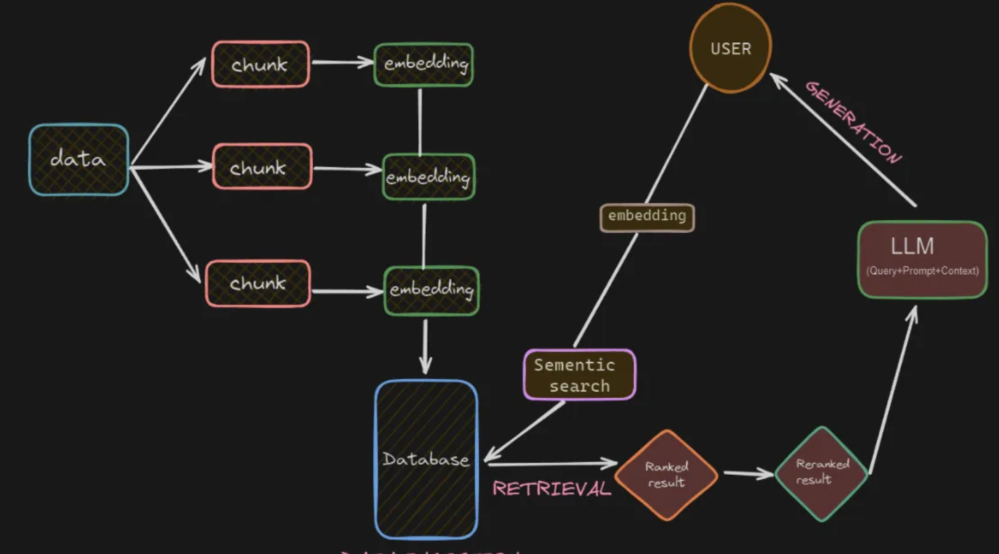
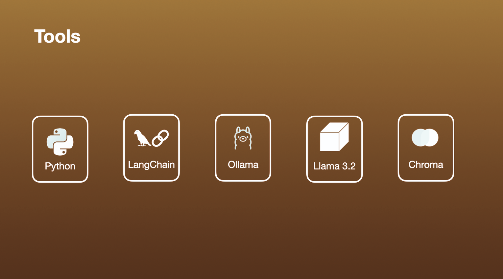
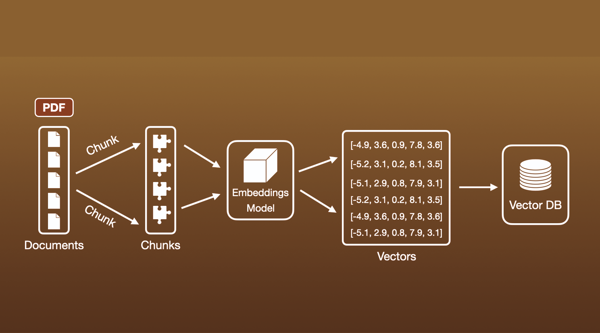
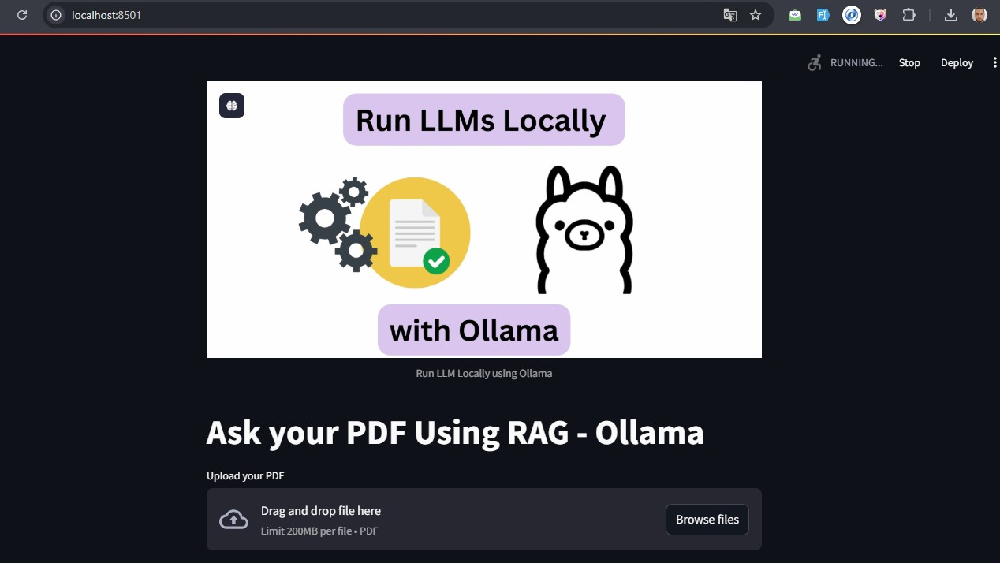
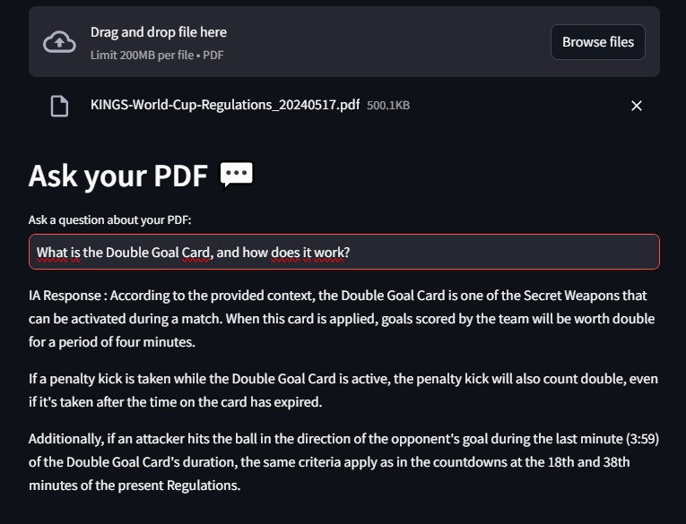

# 🤖 Chat with PDF locally using Ollama + LangChain
</img>
<br>
</img>
<br>
</img>

A powerful local RAG (Retrieval Augmented Generation) application that lets you chat with your PDF documents using Ollama and LangChain.


## ✨ Features

- 📄 PDF processing with intelligent chunking
- 🧠 Multi-query retrieval for better context understanding
- 🎯 Advanced RAG implementation using LangChain


## 🚀 Getting Started

### Prerequisites

1. **Install Ollama**
   - Visit [Ollama's website](https://ollama.ai) to download and install
   - Pull required models:
     ```bash
     ollama pull llama3.2  # or your preferred model
     ollama pull nomic-embed-text
     ```

2. **Clone Repository**
   ```bash
   git clone https://github.com/El-adarissi/Chatbot_PDF_Using_RAG_Ollama_locally-
   ```

3. **Set Up Environment**
   ```bash
   python -m venv venv
   source venv/bin/activate  # On Windows: .\venv\Scripts\activate
   pip install -r requirements.txt
   ```

   Key dependencies and their versions:
   ```txt
   ollama==0.4.4
   streamlit==1.40.0
   pdfplumber==0.11.4
   langchain==0.1.20
   langchain-core==0.1.53
   langchain-ollama==0.0.2
   chromadb==0.4.22
   ```

### 🎮 Running the Application

#### Option 1: Streamlit Interface
```bash
straemlit run app.py
```
Then open your browser to `http://localhost:8501`
</img>
<br>
</img>


## 💡 Usage Tips

1. **Upload PDF**: Use the file uploader in the Streamlit interface or try the sample PDF
2. **Ask Questions**: Start chatting with your PDF through the chat interface


Follow me on [LinkedIn](https://www.linkedin.com/in/abdelazizel-adarissi/)
"# chat-with-you-pdf" 
