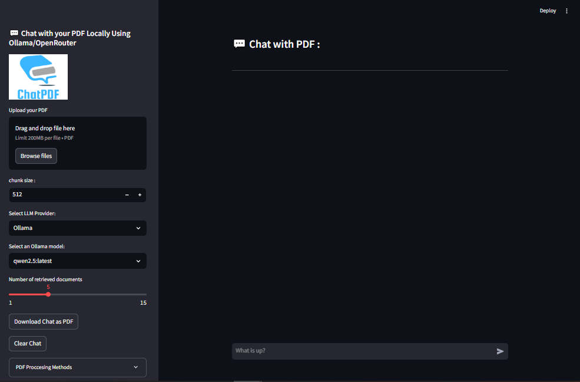
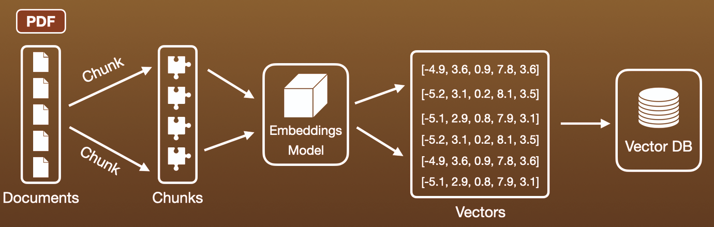
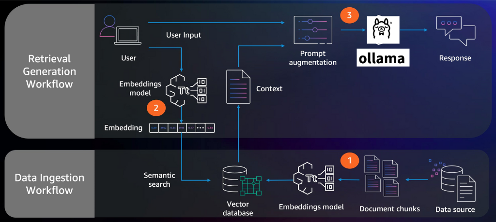
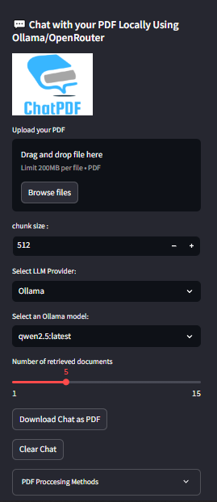
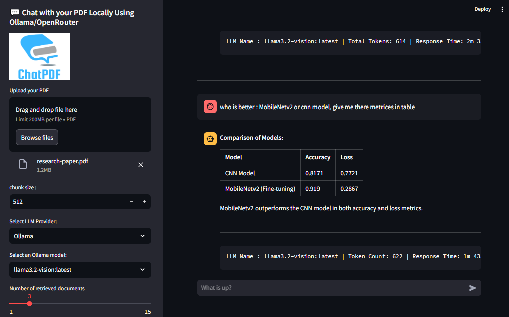

# **ChatPDF** : Chat with PDF Locally 🤖

## Overview

**ChatPDF** is an interactive web application that allows you to upload a PDF file and engage with it by querying specific information. The app processes the PDF using various techniques, such as extracting text directly or converting it to Markdown, and stores the information in a local database to generate responses to user queries. The app is powered by Ollama and integrates with the Langchain framework to generate accurate answers based on the content within the PDF. It's a powerful local RAG (Retrieval Augmented Generation) application that lets you chat with your PDF documents.


---

### Tutorial Demo


<video src="./imgs/video.mp4" autoplay controls loop controlsList="nodownload" style="max-width: 100%; height: auto;">
  Your browser does not support the video tag.
</video>


## Technology stack

- [LangChain](https://python.langchain.com/api_reference/reference.html)
- [Streamlit](https://docs.streamlit.io/)
- [Ollama](https://ollama.ai/)
- [Marker](https://github.com/VikParuchuri/marker)
- [ChromaDB](https://docs.trychroma.com/docs/overview/getting-started)
- Python

## Features

- **PDF Processing**: Extract text from PDFs directly or use advanced processing to convert PDFs to Markdown.
- **RAG Workflow**: Combines retrieval and generation for high-quality responses.
- **Customizable Retrieval**: Adjust the number of retrieved results (`n_results`) for context.
- **Memory Management**: Easily clear vector store and retrievers to reset the system.
- **Question Answering**: Use the processed PDF content to answer queries through a chatbot interface.
- **Model Selection**: Choose between model provider (Ollama or Openrouter), than choose an available Ollama LLM or enter OpenRouter LLM Name with API Key.
- **Text Retrieval**: Retrieve relevant documents from the database based on the user's query and Re-Rank the retrieved documents using BM25, semantic similarity, Recomp-like coverage, and context filtering.
- **Chat Interface**: Easy-to-use chat interface for interacting with the PDF content.
- **Download the chat conversion**.

## 🚀 Getting Started

1. **Clone the Repository**:
   Clone the repository to your local machine:
   ```bash
   git clone https://github.com/drisskhattabi6/Chat-with-PDF-Locally.git
   cd Chat-with-PDF-Locally
   ```

2. **Install Dependencies**:
   Install the necessary dependencies using `pip`:
   ```bash
   pip install -r requirements.txt
   ```

3. **Install Ollama**:
   The app requires Ollama for language models. Follow the [Ollama installation instructions](https://ollama.com/) to install it.

   - Pull required models:
     ```bash
     ollama pull nomic-embed-text:latest  # required
     ollama pull qwen2.5:latest  # or your preferred model
     ```

### 🎮 Running the Application

Run the app using the following command:

   ```bash
   streamlit run app.py
   ```

Then open your browser to `http://localhost:8501` (it will open automatically)



## Project Structure

```bash
.
├── app.py                  # Streamlit app for the user interface
├── rag.py                  # RAG System
├── md_convertor.py         # PDF to Markdown Convertor
├── requirements.txt        # List of required Python dependencies
├── imgs/                   # some screanshots, logo and video
├── PDF_ChromaDB/           # Local persistent vector store (auto-generated)
└── README.md               # Project documentation
```

---

## How it Works

1. **Upload PDF**:
   After you upload a PDF file, the app will process the content using two modes:
   - **Simple Processing**: Extracts the text directly from the PDF (faster).
   - **Advanced Processing**: Converts the PDF into Markdown format using OCR and extracts the text (slower).

2. **LLM Provider Selection**: Once the PDF is processed,Select you llm provider
   - OLLAMA : Running Loccaly, You can select a model from a list of available Ollama models.
   - OPENROUTER : using API, get API Key from `https://openrouter.ai/`

3. **Query the Content**:
   After the processing is complete, you can ask questions based on the content of the PDF. The app will use the Chroma vector database to search for relevant information and generate an accurate response using the selected Ollama model.

4. **Embedding & Vector Database**:
   The app generates embeddings from the PDF content and stores them in a Chroma vector database. This allows fast retrieval of relevant text based on user queries.

### This is the Architecture of the APP





## Features Breakdown

- **PDF Conversion**: The app uses the Marker library to convert PDFs to Markdown format. The conversion can be customized to remove images.
- **Text Chunking**: Large documents are split into manageable chunks for easier processing.
- **Embedded Models**: The app supports Ollama models for document embeddings and generating answers based on the content.
- **Chroma Vector Store**: All the processed documents are stored in a Chroma vector store for efficient retrieval.
- **RAG**: Advanced RAG implementation using LangChain

## How to Use

1. **Upload PDF**: Upload a PDF file using the file uploader in the sidebar.
2. **Choose Processing Mode**: Select between "Simple Processing" and "Advanced Processing."
3. **Start Processing**: Click the "Start Processing" button to begin the conversion and embedding process.
4. **Select Model**: Choose the Ollama model to generate the answers.
5. **Customizable Retrieval**: and you can adjust the number of retrieved results (`n_results`) for context.
6. **Ask Questions**: After processing is complete, ask questions related to the content of the PDF.
7. **Download conversion**: Download the chat conversion using the "Download" button.
8. **Clear Chat**: Clear the chat history using the "Clear Chat" button.

### Some Screenshots

### Sidebar

- Full Screen :



- PDF Processing :


---

- LLM Providers : Ollama


- LLM Providers : OpenRouter


#### Chat Interface




## Requirements

- Python 3.8+
- Pip
- Ollama models installed via `ollama pull`
- Open Router API Key
- Marker library for PDF to Markdown conversion
- Chroma for storing vector embeddings

## Troubleshooting

- if you want to use Openrouter, get the API Key, put it in '.env' file or in input text in UI.
- in '.env' file, set your OpenRouter API Key:

```bash
OPENROUTER_API_KEY='OpenRouter API Key'
```

- make sure that all libraries from 'requirements.txt' are installed, espisally 'Marker' -> `pip install marker-pdf`
- make sure that ollama is running locally.
- If no Ollama models are found, ensure that Ollama is properly installed and models are pulled using `ollama pull <model_name>`.
- Ensure that the PDF file uploaded is valid and can be processed by the app.
- The chatbot depends on your performence of your labtop, so please be patient!

---

Follow me on [LinkedIn](https://www.linkedin.com/in/idriss-khattabi-b3a266235/)
